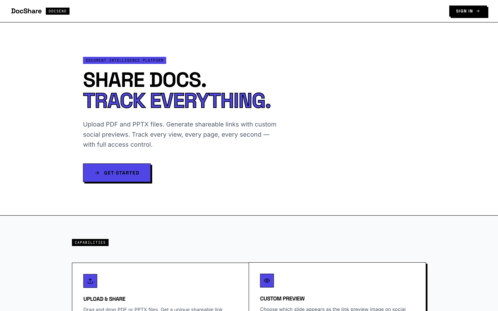

<div align="center">

# DocShare

### Send a deck that talks the viewer through itself — then see exactly which pages they read.

<a href="#"></a>
<a href="#"></a>
<a href="#"></a>
<a href="#"></a>

</div>

<div align="center"></div>

---

DocShare is a self-hostable, DocSend-style sharing platform. Upload a PDF or PowerPoint, get per-page image thumbnails rendered server-side, hand out as many independently-configured share links as you like (each with its own password, expiry, vanity slug, slide order/visibility, and social preview), layer a Loom-style video narration bubble over individual slides, and watch view, visitor, time-spent, and per-page engagement analytics inside a polished full-screen slide viewer.

It's built for founders, sales and BD teams, consultants, and agencies who send decks every week and want real engagement signal — and for the self-hosting-minded developer who'd rather own the analytics, storage, auth, and brand than rent them. Viewer data never leaves your infrastructure.

## What you can build

- **Decks that explain themselves.** Attach a talking-head video bubble to each slide so a cold-sent deck walks the viewer through it — no live call required — and reuse those clips across every deck from a versioned media library.
- **Fundraising with feedback.** Send an investor a link labelled "Investor Version" and see which slides each VC lingered on, and which they skipped, before the next meeting.
- **A due-diligence data room.** Drop the cap table, financials, and contracts into one folder, share a single password-protected link, set an expiry, and disable it the day the round closes.
- **Sales follow-up timed to real interest.** Share a proposal and see who actually opened it and how far they read — instead of guessing when to follow up.
- **One master deck, tailored per recipient.** Hide internal slides, reorder for a particular audience, and set a custom social preview — all per-link, with no duplicate files to maintain.
- **Cross-document playlists.** Pull the strongest slides from several source documents into one ordered, narrated deck for a specific audience.
- **A team workspace.** Bundle documents into folders, invite teammates by magic link with viewer/editor roles, and track engagement per variant.

## Features

### Upload & rendering

- **PDF and PPTX upload with server-side per-page rendering.** `POST /api/upload` (multer, 100MB cap, in-memory). PDFs are rendered page-by-page with `pdfjs-dist` + `@napi-rs/canvas` at 1.5x scale — pure Node, no ImageMagick or Ghostscript. PPT/PPTX are converted to PDF via headless LibreOffice (`libreoffice --headless --convert-to pdf`) and then rendered the same way. Each page becomes a PNG pushed to storage.
- **Resilient async processing.** Upload responds immediately with a `documentId` and processes in the background. Guards: an 8-minute hard job watchdog, a per-page 45s render timeout that **skips a bad page instead of failing the whole document**, and a 10-minute LibreOffice timeout. Status moves `processing → ready → error`. A PPTX fidelity warning is shown before upload.
- **Status, reprocess, and delete.** Dashboard and Document Detail surface `ready` / `processing` / `error`. Failed documents get a **Reprocess** button that re-downloads the original from storage, clears the old pages, and regenerates thumbnails. The upload page polls `documents.get` every 3s (up to 60×) to detect completion.
- **Versioned documents.** Re-upload a new file as v2, v3… via `POST /api/upload-version`. Each version generates its own page set, then promotion bumps the document's `currentVersion` and `pageCount`. A Version History panel lists every version with status, page count, filename, date, and a CURRENT badge; the viewer and analytics auto-serve the latest ready version.

### Share links — many per document, each different

- **Multiple independently-configured links per document.** Every share link has a `nanoid(10)` slug, an enable/disable toggle, a bcrypt-hashed password, an expiry date, a human label (e.g. "Investor Version"), an OG preview page number, a custom OG title and description, and a per-link slide config. One document can carry many links with totally different configs at once.
- **Custom vanity slugs.** Edit a link's slug inline (validated 3–64 chars, `^[a-z0-9-]+$`, globally unique — taken slugs return a conflict) with live sanitisation as you type.
- **Per-link slide reordering and hiding.** A drag-to-reorder SlideManager with a per-slide hide toggle, saved as a `slideConfig` array of `{pageNumber, hidden}`. The viewer applies it server-side (filters hidden slides, reorders the rest) and shows "orig. N" when the display order differs from the source page. Links with a non-default config get a CUSTOM badge; the Document Detail thumbnail strip mirrors the first configured link and flags a CONFLICT badge when multiple links disagree.
- **Password-protected and expiring links.** Passwords are bcrypt-hashed (cost 10); the viewer returns `PASSWORD_REQUIRED` then validates via `bcrypt.compare` and renders a dedicated unlock screen. Expiry and disabled state are enforced server-side (returns expired/forbidden).

### The viewer

- **Polished full-screen slide viewer** at the public `/view/:slug`. Keyboard navigation (arrows / space), `+ / - / 0` zoom (25%–300%), a desktop thumbnail sidebar, a mobile thumbnail strip toggle, a progress-dot strip (first 20 + "+N"), and prev/next controls. Dark, monospace / Space-Grotesk themed UI.
- **Hand-rolled mobile gestures.** A custom imperative touch state machine distinguishes swipe-to-navigate from pan and pinch, with focal-point pinch-zoom (1–4×) and clamped panning — not a library.

### Video narration

- **Loom-style per-slide narration bubble.** Upload pre-recorded video files (MP4 / MOV / WEBM, 500MB cap) per slide via drag-and-drop with a slide-target selector; each file is auto-assigned to the next free slide. In the viewer it appears as a draggable 200px circular bubble overlay with play/pause, mute, and hide-video, plus a first-slide "PRESS PLAY" pulse prompt (dismissal persisted in `sessionStorage`). A **REPLACE** button swaps any saved narration. Narration is version-scoped (master vs document version). *(This is upload of pre-recorded clips — there is no in-browser webcam/screen recording.)*
- **Draggable circular crop anchor.** Each narration has an adjustable crop anchor (drag a crosshair over a radial-gradient preview, stored as `cropX` / `cropY` %) so a talking-head stays framed inside the 200px circle — applied identically in the editor preview and the live viewer.
- **Reusable Narration Library with versioning and rollback.** Every narration upload also lands in a per-user media library. Upload once, attach to any slide of any document. Upload a **new version** and the new `videoUrl` auto-propagates to *every* slide narration that references it (via `mediaLibraryId`) — real referential plumbing, not a copy. Full version history with file sizes plus **Restore** (roll back to any prior version, with the same fan-out everywhere). A "Used In" usage map is grouped by document and slides; an attach dialog picks document + slide, and detach makes a narration independent.

### Video slides

- **Full-slide video embeds (video-as-a-slide).** `POST /api/upload-video-slide` stores an MP4/MOV, extracts a poster thumbnail from the first frame via ffmpeg and duration via ffprobe, and inserts it at a chosen slide position. A custom VideoSlidePlayer auto-plays, auto-advances to the next slide on end, and honours per-link controls. The narration bubble is suppressed on video slides.
- **Per-link video control restrictions.** A `videoControls` config — `allowPause`, `allowSkip` (±10s buttons), `allowScrub` (progress bar) — is stored per share link, and the player hides or disables each control accordingly. Custom controls bar with a 3s auto-hide, gradient scrim, and time display. *(Defaults to all-on; see Status below.)*

### Social previews

- **Per-link social link previews (OG) with bot detection.** `/api/og/:slug` and `/view/:slug` detect crawlers via an extensive User-Agent list (Slack / Telegram / WhatsApp / Discord / Twitter / LinkedIn, iOS `dataaccessd` / `LinkPresentation`, plus a "no Mozilla string = bot" heuristic) and serve dynamic OG / Twitter meta tags, while real browsers get an instant JS + meta-refresh redirect into the viewer. `/api/og-image/:slug` fetches the chosen slide thumbnail and resizes it with `sharp` to a 1200×630 progressive JPEG (q82, under 300KB, 24h cache) specifically so previews render on platforms like WhatsApp and iMessage that reject large images. The owner picks the preview page, title, and description per link.

### Analytics

- **Views, unique visitors, time spent, and per-page engagement.** The viewer fires `recordView` (returns a `viewId`, increments the link's view count) then `recordPageView` per slide with `timeSpentSeconds`, plus a `beforeunload` flush. Visitor uniqueness is `sha256(ip + userAgent + sessionId)` truncated to 16 chars — privacy-preserving, with no raw PII stored. Aggregations cover total views, distinct visitor count, total seconds spent, and per-page view counts rendered as a horizontal engagement heatmap. Page analytics are keyed by the **original** page number, so reordered links still line up. *(No geolocation, country, or referrer is stored — see Status below.)*

### Remixing one upload three ways

- **Per-link slide config** (order + hide), described above.
- **Sub-decks — named variants of one master.** Document Detail has a tabbed MASTER + sub-deck UI: create a named sub-deck, give it its own share links (links carry a `subDeckId`), and its analytics are tracked and aggregated separately. Per-slide position, visibility, and narration overrides are stored per sub-deck. Folder document rows expand to list their sub-decks.
- **Composed decks — cross-document playlists.** The Deck Composer builds an ordered playlist of slides pulled from *any* document in a folder, with drag-reorder and per-slot narration assigned from the folder's narration-asset library. Composed decks get their own share links and analytics, and the public viewer resolves their slots as a distinct path. *(See Status — reachable by direct URL only right now.)*

### Folders, teams, and tagging

- **Team folders with magic-link member invites.** Folders own a many-to-many set of documents, members, composed decks, and labelled sections. Invite a member by email with a viewer or editor role → generates a `nanoid(32)` join token and a `/join/:token` link (the owner is also notified). Accepting sets a separate 30-day `folder_session` JWT cookie — **no platform account required**. Sections are renamable, ordered dividers. A system folder is auto-visible to all users and admin-write-only.
- **Per-slide PRESENT tag.** Toggle a "present" tag on individual slides from the Document Detail thumbnails to flag slides that are good for live presentation.

### Auth, admin, and infrastructure

- **Passwordless magic-link auth with domain-restricted signup.** `auth.sendOtp` issues a 64-hex-char one-time token (15-min expiry) and emails a sign-in link via Resend. `GET /api/auth/verify` validates it, creates a session, and redirects returning users to `/dashboard` or new users to `/welcome` to enter their name. Signup is gated by `ALLOWED_EMAIL_DOMAINS` (comma list, or `*` for open). An `EMAIL_ALIASES` map resolves aliases to canonical accounts. Sessions are HS256 JWTs (`jose`) in a cookie. A legacy 6-digit OTP path is retained.
- **Optional external OAuth / SSO.** When `OAUTH_SERVER_URL` is set, a full OAuth code-exchange / userInfo flow (Google / Apple / Microsoft / GitHub) runs alongside magic-link. Request authentication resolves session → user, falling back to user aliases by openId then email, so merged identities map to one canonical user.
- **Admin role management.** Admin-gated `admin.listUsers` (all users with per-user document counts) and `admin.updateRole` (promote/demote admin/user). Admins are auto-granted via `ADMIN_EMAILS` or `OWNER_OPEN_ID`, or through the Admin UI, which also guards client-side.
- **Pluggable storage backend.** `STORAGE_PROVIDER` switches between an HTTP upload proxy (default), AWS S3 / Cloudflare R2 / MinIO (`S3_*` + custom endpoint, presigned GET URLs), or local filesystem (dev). One `storagePut` / `storageDelete` / `storageGet` interface, with best-effort S3 cleanup on narration and video deletes.
- **Pluggable email provider.** A default Resend adapter (`RESEND_API_KEY`, `EMAIL_FROM`, `APP_NAME`) with a branded HTML magic-link template, swappable to SMTP/SES. Fails soft — the token stays valid even if the email send fails.

## Tech stack

| Layer     | Tech                                                                          |
| --------- | ----------------------------------------------------------------------------- |
| Frontend  | React 19, Vite, Wouter (routing), TanStack Query, Tailwind v4, Radix UI / shadcn-style kit, framer-motion, lucide-react, recharts, sonner |
| API       | tRPC v11 (client + server) over Express 4, end-to-end TypeScript              |
| Database  | Drizzle ORM on MySQL / TiDB / PlanetScale (`mysql2`)                          |
| Auth      | `jose` / `jsonwebtoken` (HS256 cookies) + `bcryptjs` + magic-link (Resend) + optional OAuth SSO |
| Rendering | `pdfjs-dist` + `@napi-rs/canvas`, LibreOffice (PPTX), `sharp` (OG resize), ffmpeg (video posters) |
| Storage   | HTTP proxy / AWS S3 / Cloudflare R2 / MinIO / local disk                      |
| Build     | esbuild server bundle + Vite client; `nanoid` for slugs/tokens               |

## Quickstart

Requires Node.js 20+, a MySQL-compatible database, and — for PPTX rendering and video-slide posters — `libreoffice` and `ffmpeg`/`ffprobe` on the host.

```bash
# 1. Clone
git clone <your-fork-url> docshare
cd docshare

# 2. Install
pnpm install   # or: npm install

# 3. Configure
cp .env.example .env
# Edit .env — at minimum set DATABASE_URL and JWT_SECRET
#   node -e "console.log(require('crypto').randomBytes(32).toString('hex'))"

# 4. Create the schema
pnpm db:push

# 5. Run
pnpm dev
```

Open http://localhost:3000, enter your email, and grab the magic link from the server console — no email provider needed in dev. Build for production with `pnpm build && pnpm start`.

## Configuration

Set these in `.env` (see `.env.example` for the full list).

| Variable                | Required | What it does                                                                 |
| ----------------------- | -------- | ---------------------------------------------------------------------------- |
| `DATABASE_URL`          | Yes      | MySQL-compatible connection string. Nothing runs without it.                 |
| `JWT_SECRET`            | Yes      | Signing secret for session JWTs (≥32 random bytes).                          |
| `PUBLIC_BASE_URL`       | Yes\*    | Public URL of your deployment; used in magic links and OG previews.          |
| `ALLOWED_EMAIL_DOMAINS` | No       | Comma-separated domains allowed to **sign up**. `*` = open signup.           |
| `EMAIL_ALIASES`         | No       | Map email aliases to canonical accounts.                                     |
| `ADMIN_EMAILS`          | No       | Emails auto-granted the `admin` role on first sign-in.                       |
| `STORAGE_PROVIDER`      | No       | `proxy` (default), `s3`, or `local`. See storage adapters below.             |
| `RESEND_API_KEY`        | Prod     | Resend key for sending magic-link emails (dev prints links to console).      |
| `EMAIL_FROM`            | Prod     | Verified Resend sender address.                                              |
| `APP_NAME`              | No       | Product name shown in emails and UI.                                         |
| `OAUTH_SERVER_URL`      | No       | Enables the external OAuth/SSO flow (Google/Apple/Microsoft/GitHub).         |

\* Required for correct magic links and share-preview unfurls in production.

### Storage adapters

`STORAGE_PROVIDER` selects where uploaded files live:

| Provider | When to use                          | Needs                                                      |
| -------- | ------------------------------------ | ---------------------------------------------------------- |
| `proxy`  | Default; offloads uploads to a service | `PROXY_API_URL`, `PROXY_API_KEY`                         |
| `s3`     | **Recommended for real deployments** | `S3_*` keys + bucket/region; `S3_ENDPOINT` for R2/MinIO    |
| `local`  | Dev/test only                        | `STORAGE_LOCAL_DIR` (won't survive ephemeral hosts)        |

> The default `proxy` provider needs an external upload service. For a durable production deploy, use `s3` with S3, Cloudflare R2, or MinIO — `local` disk is wiped on ephemeral hosts.

## Make it yours

1. **Brand it.** Set `APP_NAME` and `EMAIL_FROM`; the viewer and emails follow. Tailwind v4 + Radix UI make restyling the front end straightforward.
2. **Lock down signups.** Set `ALLOWED_EMAIL_DOMAINS=yourcompany.com` so only your team can create accounts, and seed admins with `ADMIN_EMAILS`.
3. **Pick your storage.** Point `STORAGE_PROVIDER=s3` at your own bucket to keep documents and viewer data on your infrastructure.
4. **Add SSO.** Set `OAUTH_SERVER_URL` to run OAuth (Google/Apple/Microsoft/GitHub) alongside magic-link auth.
5. **Swap the mailer.** The email adapter defaults to Resend but is swappable to SMTP/SES, and fails soft so a send error never invalidates a sign-in token.

## Status — what's real vs stubbed

Credibility over hype. Read this before you build expectations on a feature:

- **Narration is uploaded video, not recorded or AI-generated.** Per-slide narration works through manually uploaded clips (MP4/MOV/WEBM, drag-drop). There is no in-browser webcam/screen recording (no `MediaRecorder`/`getUserMedia`), and the template's LLM / Whisper / image-generation scaffold files (`llm.ts`, `voiceTranscription.ts`, `imageGeneration.ts`, `dataApi.ts`, `AIChatBox`) are unused boilerplate that power nothing — `AI_API_KEY`/`AI_MODEL` exist but do nothing.
- **Analytics are page + time, not device/location.** The events table stores only a hashed visitor id, event type, page number, and seconds. Referrer and user-agent are accepted by the endpoint but never written, and there is no geo/country lookup. Only views, unique (hashed) visitors, time-spent, and per-page counts exist.
- **"AVG. TIME" shows a total, not an average.** The stat labelled AVG. TIME in Document Detail currently displays the *sum* of seconds spent.
- **Video player controls default to all-on.** `allowPause` / `allowSkip` / `allowScrub` are stored per link and enforced by the viewer, but there is currently no UI to set them and the update router doesn't accept them — so in practice all three are enabled.
- **Composed decks are reachable by direct URL only.** The Deck Composer (`/compose/:folderId/:deckId`) and folder-deck pages have working routers and routes but no visible navigation entry point from the folder UI yet.
- **Sub-decks ship via Document Detail's own tab UI.** A separate `SubDecksPanel.tsx` component is fully built but orphaned (not imported anywhere); the live sub-deck flow is Document Detail's tabs.
- **Upload progress is simulated.** The progress bar ticks to ~85% on a timer; it is not real byte-level upload progress.
- **Embedded video slides are not version-scoped.** `video_slides` has no `versionId` column, so a video slide is shared across all document versions (the `versionId` param is accepted but ignored).
- **PPTX and video posters need host binaries.** PPTX rendering requires LibreOffice; video-slide posters/duration require ffmpeg/ffprobe. Without them those paths fail (video upload still succeeds, just without a poster or duration).
- **Folder member enforcement is partial.** Any accepted editor is treated as able to edit, and most folder mutations are owner-only; viewer/editor distinctions aren't fully enforced.
- **Versions ≠ sub-decks.** A *version* is a re-uploaded file (v2/v3 with new pages); a *sub-deck* is a saved slide-selection variant of the same master with its own links and analytics.

## License

MIT © 2026
